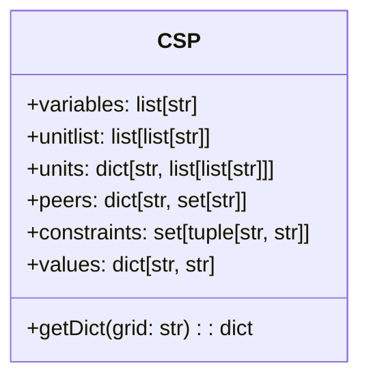
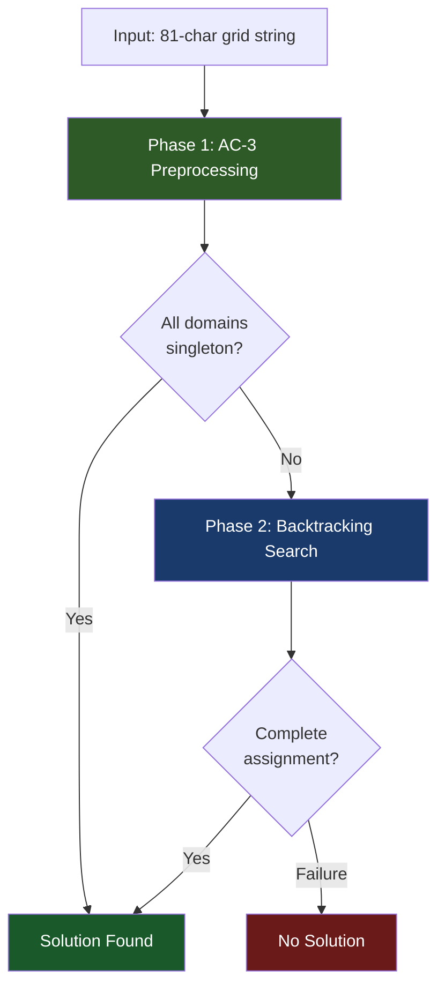
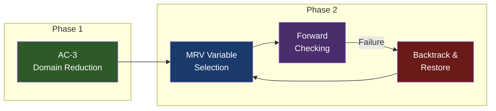
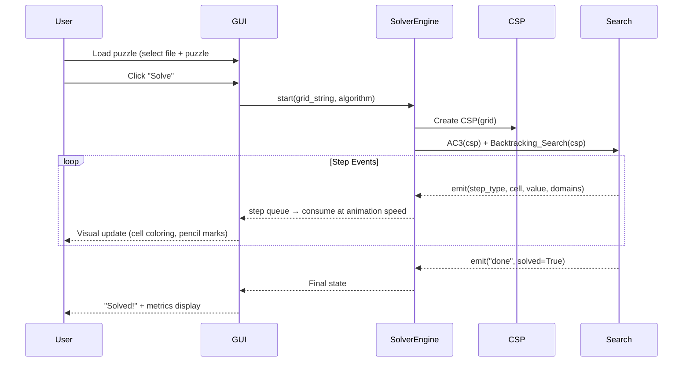

# Sudoku Solving Agent — Lab Report

## 1. Introduction

### 1.1 Problem Statement

Sudoku is a classic constraint satisfaction problem (CSP) in which a 9×9 grid must be filled with digits 1–9 such that each row, column, and 3×3 sub-box contains all digits exactly once. A standard puzzle provides a partial assignment (the "clues"), and the goal is to find a complete, consistent assignment.

This lab implements an **AI agent** that solves Sudoku puzzles by formulating the problem as a CSP and applying two complementary algorithms:

- **AC-3 (Arc Consistency 3)** — a constraint propagation technique that prunes infeasible values from variable domains.
- **Backtracking Search with Forward Checking** — a depth-first search enhanced with heuristics and inference to explore the solution space efficiently.

### 1.2 Objectives

1. Model Sudoku as a formal CSP with variables, domains, and constraints.
2. Implement the AC-3 algorithm for domain reduction.
3. Implement Backtracking Search with MRV heuristic, Forward Checking, and domain restoration.
4. Evaluate the solver on two benchmark datasets: **Project Euler** (50 puzzles) and **Magic Tour** (95 puzzles).
5. Build an interactive GUI for step-by-step visualization of the solving process.

---

## 2. CSP Formulation

### 2.1 Variables

The Sudoku grid is represented by 81 variables, one per cell. Each variable is identified by a two-character string combining a row letter (A–I) and a column digit (1–9):

```
Variables = {A1, A2, ..., A9, B1, B2, ..., I9}   (|Variables| = 81)
```

The variables are generated using the `cross` product utility:

```python
rows = "ABCDEFGHI"
cols = digits = "123456789"
squares = cross(rows, cols)  # ['A1', 'A2', ..., 'I9']
```

### 2.2 Domains

Each variable's domain is the set of digits it can take. For clue cells (given values), the domain is a singleton; for empty cells, the initial domain is `{1, 2, 3, 4, 5, 6, 7, 8, 9}`:

```python
def getDict(self, grid=""):
    for cell in self.variables:
        if grid[i] != '0':
            values[cell] = grid[i]      # singleton domain
        else:
            values[cell] = digits        # full domain "123456789"
```

Domains are stored internally as strings for efficient manipulation (e.g., `"123456789"`, `"37"`, `"5"`).

### 2.3 Constraints

The constraints enforce the **all-different** property across three types of units:

| Unit Type | Count | Description |
|-----------|-------|-------------|
| Row | 9 | All 9 cells in a row must be different |
| Column | 9 | All 9 cells in a column must be different |
| Box | 9 | All 9 cells in a 3×3 sub-box must be different |
| **Total** | **27** | |

For each variable, its **peers** are all other variables that share at least one unit with it. Each cell has exactly **20 peers** (8 from its row + 8 from its column + 4 additional from its box).

The binary constraints are explicitly enumerated as pairs:

```python
self.constraints = {(variable, peer)
                    for variable in squares
                    for peer in self.peers[variable]}
```

This gives **1620 binary constraint arcs** (81 variables × 20 peers each).

### 2.4 CSP Data Structure Summary



---

## 3. Algorithm Design

### 3.1 Overall Architecture

The solver employs a **two-phase approach**:



### 3.2 AC-3 Algorithm (Arc Consistency)

AC-3 enforces **arc consistency** by iteratively removing values from variable domains that cannot participate in any consistent assignment with a neighboring variable.

#### Pseudocode

```
function AC3(csp):
    queue ← all arcs (xi, xj) in csp.constraints
    while queue is not empty:
        (xi, xj) ← queue.dequeue()
        if REVISE(csp, xi, xj):
            if |domain(xi)| = 0:
                return False  // inconsistency detected
            for each peer xk of xi, xk ≠ xj:
                queue.enqueue((xk, xi))
    return True

function REVISE(csp, xi, xj):
    revised ← False
    for each value v in domain(xi):
        if no value w in domain(xj) satisfies v ≠ w:
            remove v from domain(xi)
            revised ← True
    return revised
```

#### Implementation

```python
def AC3(csp):
    queue = list(csp.constraints)
    while queue:
        (xi, xj) = queue.pop(0)
        if Revise(csp, xi, xj):
            if len(csp.values[xi]) == 0:
                return False
            for peer in csp.peers[xi]:
                if peer != xj:
                    queue.append((peer, xi))
    return True

def Revise(csp, xi, xj):
    revised = False
    for value in csp.values[xi]:
        if not any(v != value for v in csp.values[xj]):
            csp.values[xi] = csp.values[xi].replace(value, '')
            revised = True
    return revised
```

**Key insight**: The `Revise` function removes a value `v` from `domain(xi)` only when `domain(xj) = {v}` (i.e., `xj` is already assigned to `v`). This ensures no two peers can hold the same value.

#### Complexity

- **Time**: O(n² · d³) where n = number of variables (81) and d = max domain size (9)
- **Space**: O(n²) for the queue

### 3.3 Backtracking Search

Backtracking Search is a depth-first search that assigns values to one variable at a time and backtracks when an inconsistency is detected.

#### Pseudocode

```
function BACKTRACKING-SEARCH(csp):
    AC3(csp)                              // preprocess
    assignment ← {v: d | v ∈ vars, |domain(v)| = 1}
    return RECURSIVE-BACKTRACK(assignment, csp)

function RECURSIVE-BACKTRACK(assignment, csp):
    if assignment is complete:
        return assignment
    var ← SELECT-UNASSIGNED-VARIABLE(assignment, csp)  // MRV
    for each value in ORDER-DOMAIN-VALUES(var, csp):
        if value is consistent with assignment:
            assignment[var] ← value
            saved ← deep copy of domains
            inferences ← FORWARD-CHECK(assignment, csp, var, value)
            if inferences ≠ FAILURE:
                result ← RECURSIVE-BACKTRACK(assignment, csp)
                if result ≠ FAILURE:
                    return result
            remove var from assignment
            restore domains from saved
    return FAILURE
```

### 3.4 Heuristics and Optimizations

#### 3.4.1 Minimum Remaining Values (MRV) Heuristic

The **MRV heuristic** (also called "most constrained variable" or "fail-first") selects the unassigned variable with the **smallest domain**:

```python
def Select_Unassigned_Variables(assignment, csp):
    unassigned_variables = dict(
        (sq, len(csp.values[sq])) for sq in csp.values
        if sq not in assignment.keys()
    )
    mrv = min(unassigned_variables, key=unassigned_variables.get)
    return mrv
```

**Rationale**: By choosing the variable most likely to cause a failure, the algorithm detects dead-ends earlier, significantly pruning the search tree.

#### 3.4.2 Forward Checking (Inference)

After each assignment, **Forward Checking** propagates the constraint to all peers by removing the assigned value from their domains:

```python
def Inference(assignment, inferences, csp, var, value):
    inferences[var] = value
    for neighbor in csp.peers[var]:
        if neighbor not in assignment and value in csp.values[neighbor]:
            if len(csp.values[neighbor]) == 1:
                return "FAILURE"  # would create empty domain
            remaining = csp.values[neighbor] = \
                csp.values[neighbor].replace(value, "")
            if len(remaining) == 1:
                # Recursively propagate singleton domains
                flag = Inference(assignment, inferences, csp, neighbor, remaining)
                if flag == "FAILURE":
                    return "FAILURE"
    return inferences
```

**Key features**:
- Detects failures early when a peer's domain would become empty.
- Performs **recursive propagation**: when a domain is reduced to a single value, that value is further propagated to its peers (creating a chain reaction effect similar to constraint propagation).

#### 3.4.3 Domain Restoration on Backtrack

When backtracking, all domain changes made during inference are reversed by restoring a deep copy of the domain values:

```python
saved_values = deepcopy(csp.values)
# ... attempt assignment and inference ...
# On failure:
del assignment[var]
csp.values = saved_values  # restore all domains
```

### 3.5 Algorithm Integration Summary



---

## 4. Implementation Structure

### 4.1 Project File Structure

| File | Lines | Description |
|------|-------|-------------|
| `util.py` | 21 | Constants (`rows`, `cols`, `digits`, `squares`) and `cross()` utility |
| `csp.py` | 53 | CSP class: variables, units, peers, constraints, domain initialization |
| `search.py` | 157 | Core algorithms: AC-3, Backtracking Search, MRV, Forward Checking |
| `sudoku.py` | 42 | Command-line entry point for batch solving |
| `solver_engine.py` | 298 | Instrumented solver engine for GUI visualization (step events) |
| `ui_components.py` | 260 | Pygame UI widgets: Button, Dropdown, Slider |
| `gui.py` | 848 | Interactive desktop GUI with real-time solving visualization |

### 4.2 Data Flow



### 4.3 GUI Features

The interactive Pygame-based GUI provides:

- **Board Visualization**: 9×9 grid with color-coded cells (clues = white, AC-3 assignments = green, guesses = blue, conflicts = red).
- **Pencil Marks**: Remaining domain values displayed as small digits in a 3×3 sub-grid within each cell.
- **Algorithm Selection**: Choose between "AC-3 + Backtracking", "Backtracking Only", or "AC-3 Only".
- **Speed Control**: Adjustable step delay slider (5–500ms) for controlling animation speed.
- **Step-by-Step Mode**: Pause/Resume and single-step controls for detailed algorithm inspection.
- **Batch Mode**: "Solve All" button to solve all puzzles in a file and export results.
- **Metrics Panel**: Real-time display of time elapsed, nodes explored, guesses made, and backtracks.

---

## 5. Experimental Results

### 5.1 Test Datasets

| Dataset | Puzzles | Avg Clues | Min Clues | Max Clues | Source |
|---------|---------|-----------|-----------|-----------|--------|
| Project Euler | 50 | 28.4 | 22 | 36 | Project Euler Problem 96 |
| Magic Tour | 95 | 20.6 | 17 | 26 | Magic Tour collection |

> [!NOTE]
> The Magic Tour dataset contains significantly harder puzzles with fewer given clues (average 20.6 vs 28.4), making them more challenging for constraint-based solvers.

### 5.2 Benchmark Results (AC-3 + Backtracking)

The solver was benchmarked using the combined **AC-3 + Backtracking** algorithm. All tests were run on the same machine.

#### 5.2.1 Overall Performance Summary

| Metric | Project Euler | Magic Tour |
|--------|:-------------:|:----------:|
| **Total Puzzles** | 50 | 95 |
| **Solved** | **50/50 (100%)** | **95/95 (100%)** |
| **Total Time** | 2.09 s | 86.14 s |
| **Average Time** | 0.042 s | 0.907 s |
| **Median Time** | 0.041 s | 0.160 s |
| **Min Time** | 0.022 s | 0.040 s |
| **Max Time** | 0.070 s | 13.846 s |

> [!IMPORTANT]
> The solver achieves a **100% solve rate** across all 145 puzzles in both datasets, demonstrating the completeness of the Backtracking Search algorithm.

#### 5.2.2 Time Distribution

| Time Range | Euler (50 puzzles) | Magic Tour (95 puzzles) |
|:----------:|:------------------:|:-----------------------:|
| < 50 ms | 42 (84%) | 5 (5.3%) |
| 50–500 ms | 8 (16%) | 69 (72.6%) |
| 500 ms – 2 s | 0 (0%) | 10 (10.5%) |
| > 2 s | 0 (0%) | 11 (11.6%) |

#### 5.2.3 Per-Puzzle Timing — Project Euler

| # | Clues | Time (s) | # | Clues | Time (s) | # | Clues | Time (s) |
|:-:|:-----:|:--------:|:-:|:-----:|:--------:|:-:|:-----:|:--------:|
| 1 | 32 | 0.040 | 18 | 29 | 0.042 | 35 | 30 | 0.038 |
| 2 | 30 | 0.039 | 19 | 32 | 0.025 | 36 | 32 | 0.033 |
| 3 | 28 | 0.042 | 20 | 32 | 0.031 | 37 | 32 | 0.035 |
| 4 | 30 | 0.035 | 21 | 30 | 0.044 | 38 | 30 | 0.035 |
| 5 | 36 | 0.025 | 22 | 26 | 0.040 | 39 | 30 | 0.040 |
| 6 | 24 | 0.055 | 23 | 28 | 0.040 | 40 | 32 | 0.035 |
| 7 | 26 | 0.040 | 24 | 26 | 0.042 | 41 | 26 | 0.058 |
| 8 | 36 | 0.033 | 25 | 28 | 0.042 | 42 | 26 | 0.046 |
| 9 | 26 | 0.055 | 26 | 24 | 0.047 | 43 | 26 | 0.050 |
| 10 | 28 | 0.048 | 27 | 27 | 0.041 | 44 | 24 | 0.055 |
| 11 | 28 | 0.039 | 28 | 28 | 0.041 | 45 | 26 | 0.047 |
| 12 | 32 | 0.031 | 29 | 27 | 0.049 | 46 | 24 | 0.065 |
| 13 | 27 | 0.044 | 30 | 26 | 0.046 | 47 | 23 | 0.039 |
| 14 | 27 | 0.041 | 31 | 25 | 0.051 | 48 | 25 | 0.040 |
| 15 | 26 | 0.041 | 32 | 26 | 0.041 | 49 | 22 | 0.070 |
| 16 | 36 | 0.029 | 33 | 32 | 0.038 | 50 | 25 | 0.052 |
| 17 | 36 | 0.022 | 34 | 31 | 0.029 | | | |

#### 5.2.4 Hardest Magic Tour Puzzles (> 2 seconds)

| Puzzle # | Clues | Time (s) | Difficulty Factor |
|:--------:|:-----:|:--------:|:-----------------:|
| **6** | 17 | **13.846** | Extreme |
| 28 | 17 | 9.386 | Very Hard |
| 34 | 17 | 6.361 | Very Hard |
| 21 | 17 | 6.319 | Very Hard |
| 7 | 17 | 4.784 | Hard |
| 10 | 17 | 4.656 | Hard |
| 46 | 17 | 4.595 | Hard |
| 4 | 17 | 4.507 | Hard |
| 18 | 17 | 4.050 | Hard |
| 71 | 17 | 3.935 | Hard |
| 9 | 17 | 3.644 | Hard |

> [!NOTE]
> All 11 puzzles exceeding 2 seconds have exactly **17 clues** — the theoretical minimum number of clues for a Sudoku puzzle to have a unique solution.

---

## 6. Analysis and Discussion

### 6.1 Effect of Number of Clues on Difficulty

The experimental results clearly demonstrate an **inverse correlation between the number of given clues and solving time**:

| Clue Count | Avg Time (Euler) | Avg Time (Magic Tour) |
|:----------:|:----------------:|:---------------------:|
| 17 | — | 2.99 s |
| 19–22 | 0.063 s | 0.18 s |
| 23–26 | 0.048 s | 0.13 s |
| 27–30 | 0.044 s | — |
| 31–36 | 0.036 s | — |

**Observations**:
- Puzzles with 17 clues (Magic Tour) average ~64× longer solving time compared to puzzles with 30+ clues (Euler).
- The Euler dataset, with an average of 28.4 clues, contains relatively moderate puzzles where AC-3 alone can significantly reduce domains.
- The Magic Tour dataset pushes the solver harder: 46 out of 95 puzzles have only 17 clues, forcing extensive backtracking.

### 6.2 Role of AC-3 Preprocessing

AC-3 preprocessing dramatically reduces the search space before backtracking begins:

1. **For easy puzzles** (many clues): AC-3 alone can often solve the entire puzzle by repeatedly propagating singleton domains, eliminating the need for backtracking entirely.
2. **For hard puzzles** (few clues): AC-3 significantly reduces variable domains (e.g., from 9 candidates to 2–4), which:
   - Reduces the branching factor of the search tree
   - Enables MRV to make more informed variable selections
   - Decreases the number of guesses and backtracks needed

### 6.3 Effectiveness of MRV Heuristic

The MRV (Minimum Remaining Values) heuristic is critical for performance. By always selecting the variable with the fewest remaining domain values:

- **Fail-first principle**: Variables most likely to cause a conflict are tried first, detecting dead-ends early.
- **Reduced branching**: Variables with smaller domains have fewer values to try, decreasing the effective branching factor.
- Without MRV (e.g., using a fixed ordering), the hardest Magic Tour puzzles could take orders of magnitude longer.

### 6.4 Forward Checking with Recursive Propagation

The `Inference` function goes beyond basic forward checking by implementing **recursive constraint propagation**:

1. When a value is assigned to a variable, it is removed from all peers' domains.
2. If a peer's domain is reduced to a single value, that value is immediately propagated to **its** peers.
3. This creates a cascade effect similar to running AC-3 locally after each assignment.

This is particularly effective for Sudoku because assigning one cell often forces a chain of singleton assignments across the board.

### 6.5 Performance Comparison: Euler vs. Magic Tour

| Aspect | Project Euler | Magic Tour |
|--------|:-------------:|:----------:|
| Avg clues | 28.4 | 20.6 |
| Avg solve time | 41.7 ms | 906.7 ms |
| Time variance | Very low (σ ≈ 10 ms) | Very high (σ ≈ 2.3 s) |
| AC-3 alone sufficient? | Often | Rarely |
| Backtracking depth | Shallow | Often deep |
| Worst-case time | 70 ms | 13.8 s |

The Magic Tour dataset's **high variance** is notable: the median time is only 160 ms, but the worst case is 13.8 s — an 87× ratio, compared to only 3.3× for Euler. This reflects the exponential nature of backtracking search on truly hard instances.

---

## 7. Conclusion

### 7.1 Summary of Results

- The Sudoku Solving Agent successfully solves **all 145 test puzzles** (50 Euler + 95 Magic Tour) with a **100% solve rate**.
- The combined **AC-3 + Backtracking** approach with MRV heuristic and Forward Checking provides an efficient and complete solver.
- Project Euler puzzles (avg 28.4 clues) are solved in an average of **42 ms**.
- Magic Tour puzzles (avg 20.6 clues) are solved in an average of **907 ms**, with the hardest puzzle (17 clues) taking **13.8 s**.

### 7.2 Key Takeaways

1. **Constraint propagation (AC-3) is essential** — it dramatically reduces the search space before backtracking begins.
2. **MRV heuristic is critical** — choosing the most constrained variable first prevents exponential blowup on hard puzzles.
3. **Forward Checking with recursive propagation** acts as an embedded mini-AC-3 during search, catching inconsistencies early.
4. **Puzzle difficulty scales inversely with clue count** — fewer clues mean larger search spaces and more backtracking.
5. **The algorithm is complete** — guaranteed to find a solution if one exists, or correctly report failure.

### 7.3 Potential Improvements

| Improvement | Expected Benefit |
|-------------|-----------------|
| **Least Constraining Value (LCV)** ordering | Try values that rule out fewest options for peers first |
| **Naked/Hidden Pairs/Triples** | Additional constraint propagation techniques |
| **Constraint Learning** | Remember and avoid previously discovered dead-end patterns |
| **MAC (Maintaining Arc Consistency)** | Run full AC-3 after each assignment instead of just forward checking |
| **Bitwise domain representation** | Use integer bitmasks instead of strings for faster domain operations |

---

## Appendix A: Output Files

- **EulerSolutions.txt** — 50 solved puzzles, each as an 81-character string
- **MagicTourSolutions.txt** — 95 solved puzzles, each as an 81-character string
- **benchmark.py** — Script used to collect the experimental statistics presented in this report

## Appendix B: How to Run

```bash
# Command-line batch solver
python sudoku.py --inputFile data/euler.txt

# Interactive GUI
python gui.py

# Benchmark script
python benchmark.py
```
